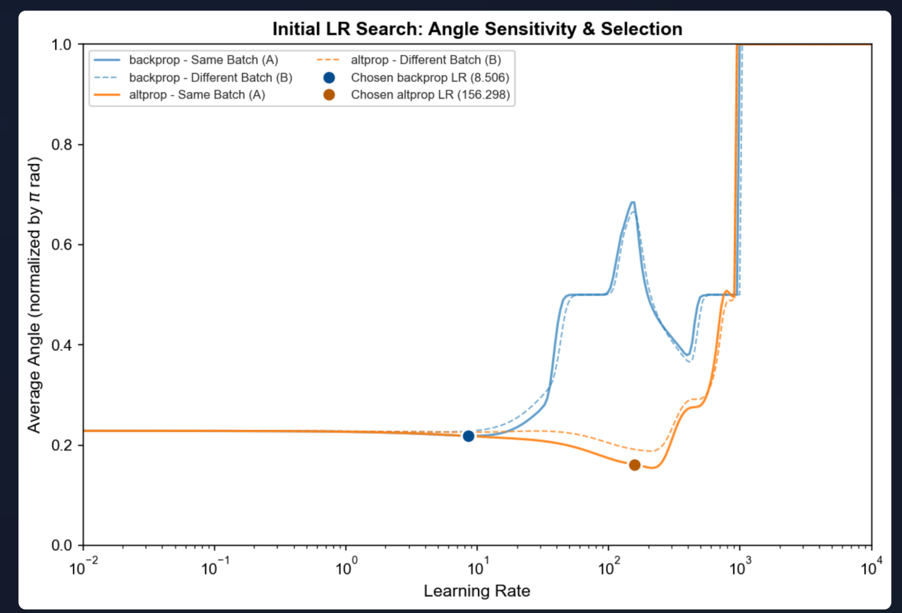
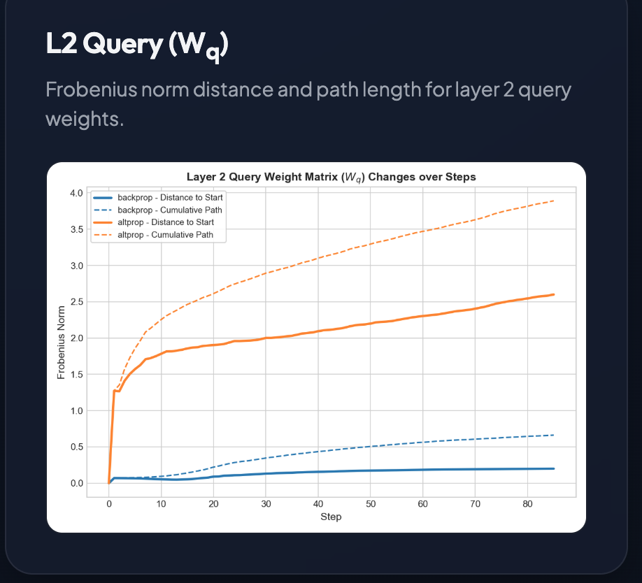
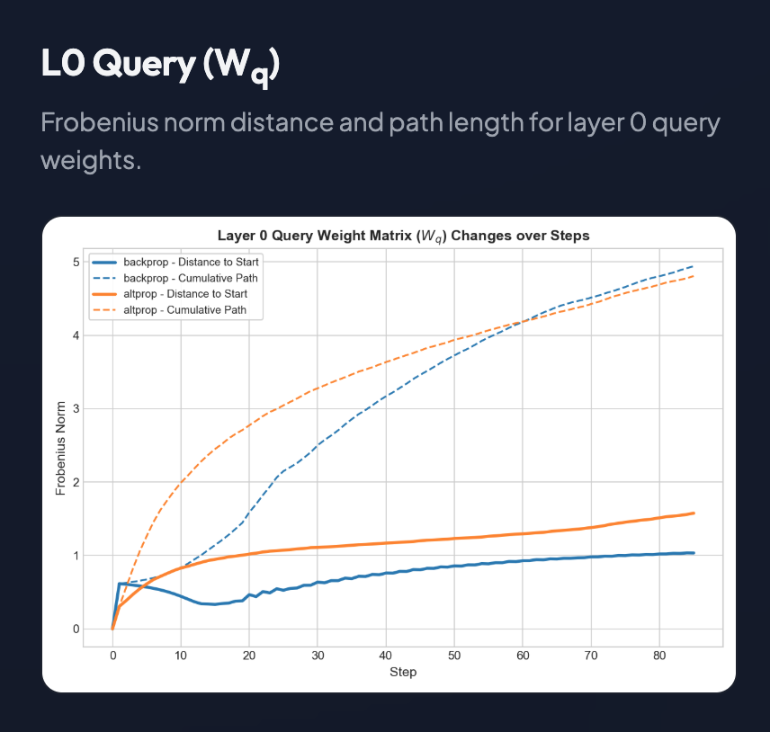

# Experiment 03jun26: backprop alternative on an easy inverse problem


```
uv run altprop_linattention.py
uv run linattention_visualize.py
```


## Easy problem

1. stripped down [Linear Transformer](https://manifestai.com/blogposts/faster-after-all/) (drop the softplus)
2. teacher is initialized with small rotations (Pi/10)
3. student is initialized with identity matrices
4. Initialize LR using line search, apply adaptive LR tuning at each step


## Observations
[from report](https://yaroslavvb.github.io/inverse-problems/reports/linattention_report.html)

- Alternative allows using much larger learning rate and converges faster



- Alternative trains last layer much more than the first layer
- regular backprop trains first layer more than last layer

 

- automatic tuner results in decreasing learning rate schedule for alternative propagation whereas for classic backprop it is constant 

*Initial prototyping in [colab](https://colab.research.google.com/drive/1t3YD6hQsBcTwnaVPKxgVoMRo-idLjze3#scrollTo=rg9J-sPFR3Gd).*

# Experiment 09jun26: orthogonality-exploiting updates

Single-layer linear attention student/teacher with random **orthogonal** W_q, W_k, W_v
([linattention_solve.py](linattention_solve.py)). Since the solution lies on O(32)^3,
compare updates that exploit that structure (multiplicative expm/Cayley rotations, so(n)-Adam,
retractions, landing, Procrustes/two-block solvers) against Euclidean SGD/Adam.

```
uv run linattention_solve.py        # simple single-layer baseline + loss plot
uv run ortho_updates.py --verify    # pre-flight math checks
uv run ortho_updates.py             # full comparison sweep
```

## Observations
[from report](https://yaroslavvb.github.io/inverse-problems/reports/ortho_updates_report.html)

- Exploiting **bilinearity** beats exploiting the manifold: a two-block Procrustes/least-squares
  solver converges in 10 alternations
  ([detailed report](https://yaroslavvb.github.io/inverse-problems/reports/two_block_report.html));
  closed-form W_v + rotation steps reaches 1e-12 in ~121 steps vs 338 for Adam
- Generic manifold methods (expm/Cayley/QR/polar, ~246 steps) beat Adam but only match well-tuned plain SGD (221);
  the rotation-angle-parameterized optimizers (so(n)-Adam, trivialization, clipped momentum) are slower deep
  (~290-314) but tolerate a ~10x wider learning-rate window
- **Determinant obstruction**: det-preserving updates can't leave a connected component of O(n) — 3/4 of random
  inits floor at ~5e-4 error unless the init's det signs are matched to the teacher (one column flip)
- Re-tuned for the first 100x error reduction, the ranking inverts: procrustes_alt crosses in 20 steps and
  decoupled Adam in 53, vs 78 for Adam and 138 for the manifold family
- **Learning without Forgetting**
  ([report](https://yaroslavvb.github.io/inverse-problems/reports/forgetting_report.html),
  `uv run forgetting_lab.py`): reading Muon's spectral descent as worst-case forgetting control in a streaming
  setting (2 sequences/round) — the spectral bound is real, but with random sources a 32-sequence replay buffer
  beats every geometric constraint by 100x, and average-case (Frobenius/Fisher) anchors beat the worst-case
  spectral family; Tilde's compositional Muon keeps the layer's composed forgetting budget from factor access
  (realizing 0.199 of a 0.200 budget vs 2.4x overshoot for naive per-factor Muon) and edges out the rest of the
  spectral family; rerun on real pre-trained pythia-14m head circuits (`uv run forgetting_pretrained.py` —
  teacher and student are actual heads, factor conditions 68/28, imbalance 4.9x), compositional Muon wins
  outright on every seed and naive factored Muon overshoots the composed budget 3.1x

# Experiment 11jun26: is the QK circuit Zipf-distributed too?

Empirical check of the associative-memory/Zipf premise behind Muon's advantage
([Kim, Nichani, Wu, Bietti & Lee, arXiv:2603.26554](https://arxiv.org/abs/2603.26554)) on a real
pre-trained transformer: does the KQ circuit of self-attention see the power-law association
structure the paper's mechanism needs, the way the FFN plausibly does?

```
uv run zipf_qk_probe.py --smoke   # pipeline self-check (dL/dA vs autograd ~2e-6)
uv run zipf_qk_probe.py           # full probe: GPT-2 on WikiText-2, trained + re-init, ~35s
```

## Observations
[from report](https://yaroslavvb.github.io/inverse-problems/reports/zipf_qk_report.html)

- **Yes, comparably to the FFN**: at trained weights the per-head QK-circuit gradients dL/dA are steeper
  than content-destroyed shuffled-input nulls in 34-36 of 36 heads (median tail-slope gap -0.12,
  vs -0.13..-0.19 for the FFN), and QK direction usage is more heavy-tailed than FFN neuron usage
- Raw "Zipf-looking" gradient spectra are mostly input geometry — structureless nulls alone give
  slope ~ -0.7 of the ~ -0.8; the mechanism-specific evidence is the true-vs-null gap
- At random init the QK heavy tail is **positional, not content-based** (a position-preserving null
  reproduces it), while the FFN shows content structure from the start — content-Zipf structure in
  attention is built by training
- Both circuits sit on strongly anisotropic inputs (the paper's Fig. 6 axis where Muon cedes ground
  to Newton) — a caveat that applies to FFN and attention alike
