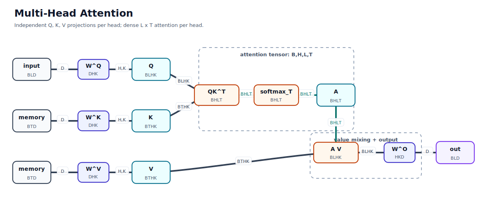
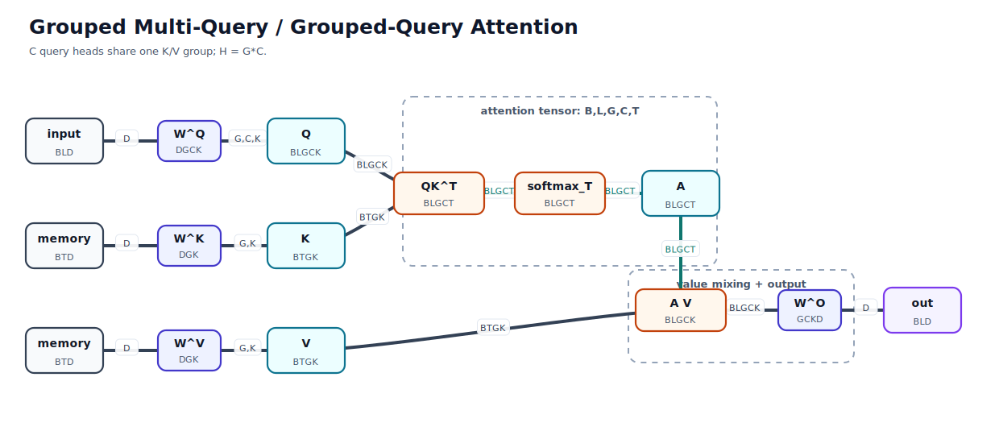
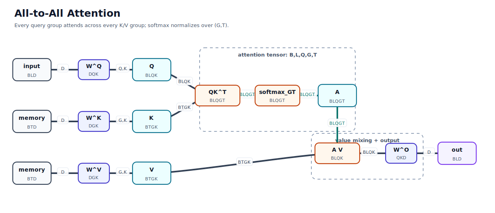
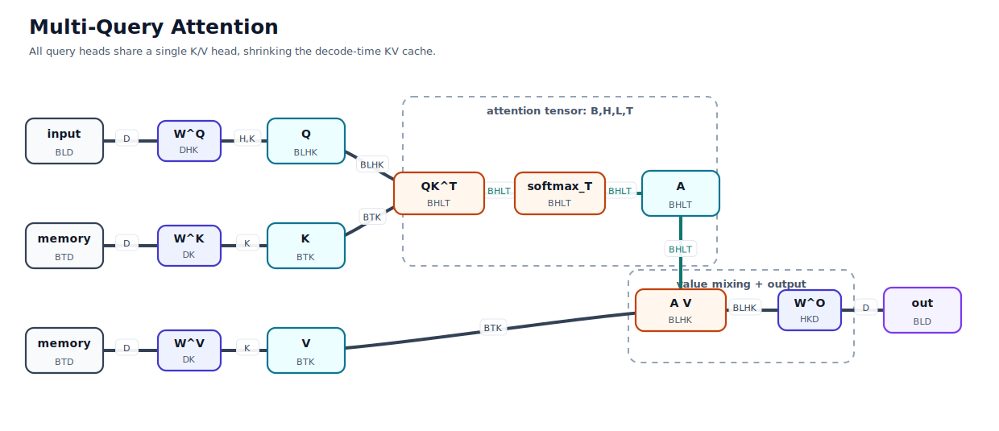
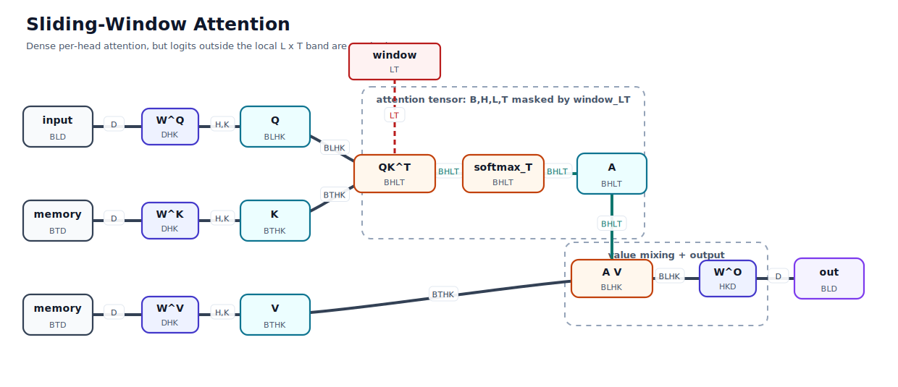
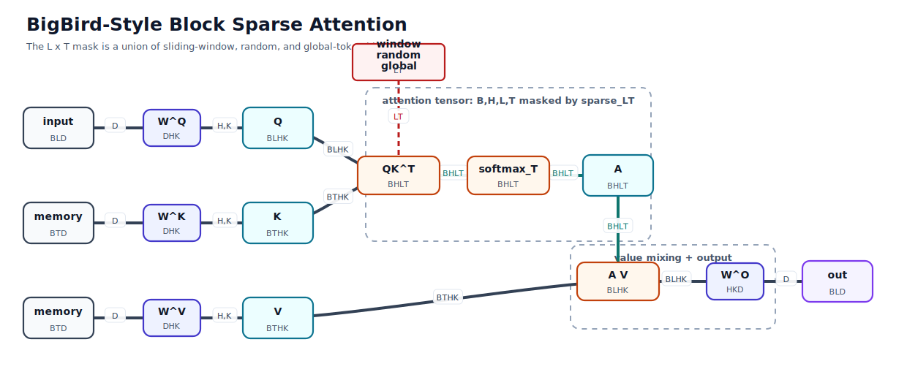
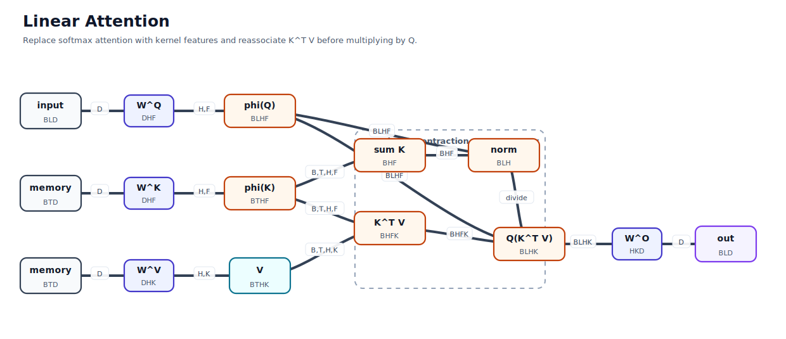
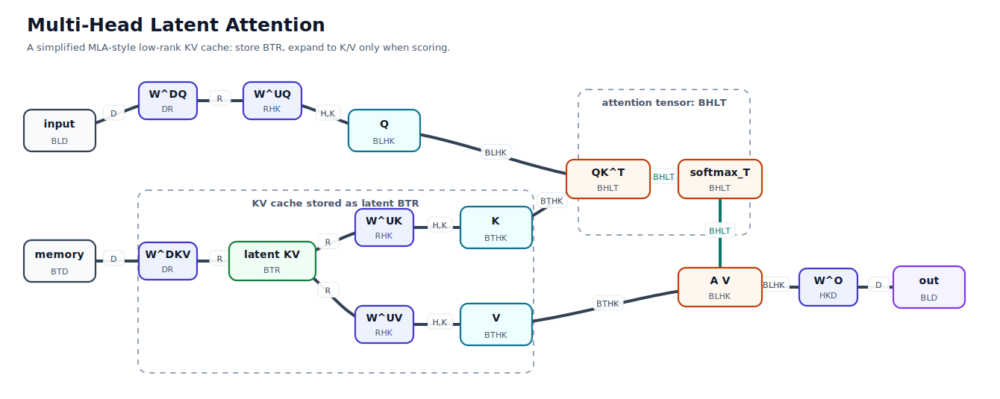

# Transformer Attention Variants

Generated by `attention_variant_diagrams.py`.

The equations use Noam-style shape suffixes: every tensor name ends with the ordered logical dimensions in that tensor. The diagrams use a TensorGrad-inspired notation: tensors are nodes, repeated named dimensions are contractions, and free dimensions remain visible as suffixes.

## Dimension key

- `B`: batch
- `L`: query sequence length
- `T`: key/value sequence length
- `D`: model dimension
- `H`: query heads
- `K`: per-head key/value channel
- `G`: key/value groups
- `C`: query heads inside each key/value group
- `Q`: query groups
- `F`: kernel feature dimension for linear attention
- `R`: latent/compressed KV rank

## Variants

### Multi-Head Attention

Independent Q, K, V projections per head; dense L x T attention per head.



**Noam-style einsum**

```python
query_BLHK = einsum("BLD,DHK->BLHK", input_BLD, w_q_DHK)
key_BTHK = einsum("BTD,DHK->BTHK", memory_BTD, w_k_DHK)
value_BTHK = einsum("BTD,DHK->BTHK", memory_BTD, w_v_DHK)
logits_BHLT = einsum("BLHK,BTHK->BHLT", query_BLHK, key_BTHK) / sqrt(K)
weights_BHLT = softmax(logits_BHLT, dim="T")
wtd_values_BLHK = einsum("BHLT,BTHK->BLHK", weights_BHLT, value_BTHK)
out_BLD = einsum("BLHK,HKD->BLD", wtd_values_BLHK, w_o_HKD)
```

**TensorGrad-style graph spec**

```text
# score logits_BHLT
input_q -D- Wq
memory_k -D- Wk
Wq -K- Wk
# H remains a free shared edge in logits_BHLT
# A_BHLT = softmax_T(logits_BHLT)
# output out_BLD
A -T- memory_v
memory_v -D- Wv
A -H- *head
Wv -H- *head
*head -H- Wo
Wv -K- Wo
A -L-
Wo -D-
```

Sources: [Noam Shazeer, Shape Suffixes - Good Coding Style](https://medium.com/@NoamShazeer/shape-suffixes-good-coding-style-f836e72e24fd); [Vaswani et al., Attention Is All You Need](https://arxiv.org/abs/1706.03762)

### Grouped Multi-Query / Grouped-Query Attention

C query heads share one K/V group; H = G*C.



**Noam-style einsum**

```python
# H = G * C
query_BLGCK = einsum("BLD,DGCK->BLGCK", input_BLD, w_q_DGCK)
key_BTGK = einsum("BTD,DGK->BTGK", memory_BTD, w_k_DGK)
value_BTGK = einsum("BTD,DGK->BTGK", memory_BTD, w_v_DGK)
logits_BLGCT = einsum("BLGCK,BTGK->BLGCT", query_BLGCK, key_BTGK) / sqrt(K)
weights_BLGCT = softmax(logits_BLGCT, dim="T")
wtd_values_BLGCK = einsum("BLGCT,BTGK->BLGCK", weights_BLGCT, value_BTGK)
out_BLD = einsum("BLGCK,GCKD->BLD", wtd_values_BLGCK, w_o_GCKD)
```

**TensorGrad-style graph spec**

```text
# score logits_BLGCT
input_q -D- Wq
memory_k -D- Wk
Wq -K- Wk
# G and C stay free; A_BLGCT = softmax_T(logits_BLGCT)
# output out_BLD
A -T- memory_v
memory_v -D- Wv
A -G- *group
Wv -G- *group
*group -G- Wo
Wv -K- Wo
A -C- Wo
A -L-
Wo -D-
```

Sources: [Noam Shazeer, Shape Suffixes - Good Coding Style](https://medium.com/@NoamShazeer/shape-suffixes-good-coding-style-f836e72e24fd); [Noam Shazeer, Fast Transformer Decoding: One Write-Head is All You Need](https://arxiv.org/abs/1911.02150); [Ainslie et al., GQA: Training Generalized Multi-Query Transformer Models from Multi-Head Checkpoints](https://aclanthology.org/2023.emnlp-main.298/)

### All-to-All Attention

Every query group attends across every K/V group; softmax normalizes over (G,T).



**Noam-style einsum**

```python
query_BLQK = einsum("BLD,DQK->BLQK", input_BLD, w_q_DQK)
key_BTGK = einsum("BTD,DGK->BTGK", memory_BTD, w_k_DGK)
value_BTGK = einsum("BTD,DGK->BTGK", memory_BTD, w_v_DGK)
logits_BLQGT = einsum("BLQK,BTGK->BLQGT", query_BLQK, key_BTGK) / sqrt(K)
weights_BLQGT = softmax(logits_BLQGT, dim=("G", "T"))
wtd_values_BLQK = einsum("BLQGT,BTGK->BLQK", weights_BLQGT, value_BTGK)
out_BLD = einsum("BLQK,QKD->BLD", wtd_values_BLQK, w_o_QKD)
```

**TensorGrad-style graph spec**

```text
# score logits_BLQGT
input_q -D- Wq
memory_k -D- Wk
Wq -K- Wk
# Q and G both stay visible in the attention tensor
# A_BLQGT = softmax_GT(logits_BLQGT)
# output out_BLD
A -T- memory_v
memory_v -D- Wv
A -G- Wv
Wv -K- Wo
A -Q- Wo
A -L-
Wo -D-
```

**Notes**

- This is an exploratory structural variant from the prompt rather than a named paper baseline.
- If you want per-KV-group normalization instead, change softmax_GT to softmax_T and keep G until the value contraction.

Sources: [Noam Shazeer, Shape Suffixes - Good Coding Style](https://medium.com/@NoamShazeer/shape-suffixes-good-coding-style-f836e72e24fd)

### Multi-Query Attention

All query heads share a single K/V head, shrinking the decode-time KV cache.



**Noam-style einsum**

```python
query_BLHK = einsum("BLD,DHK->BLHK", input_BLD, w_q_DHK)
key_BTK = einsum("BTD,DK->BTK", memory_BTD, w_k_DK)
value_BTK = einsum("BTD,DK->BTK", memory_BTD, w_v_DK)
logits_BHLT = einsum("BLHK,BTK->BHLT", query_BLHK, key_BTK) / sqrt(K)
weights_BHLT = softmax(logits_BHLT, dim="T")
wtd_values_BLHK = einsum("BHLT,BTK->BLHK", weights_BHLT, value_BTK)
out_BLD = einsum("BLHK,HKD->BLD", wtd_values_BLHK, w_o_HKD)
```

**TensorGrad-style graph spec**

```text
# score logits_BHLT
input_q -D- Wq
memory_k -D- Wk
Wq -K- Wk
# H is free only on Q; K/V are shared across H
# output out_BLD
A -T- memory_v
memory_v -D- Wv
Wv -K- Wo
A -H- Wo
A -L-
Wo -D-
```

Sources: [Noam Shazeer, Shape Suffixes - Good Coding Style](https://medium.com/@NoamShazeer/shape-suffixes-good-coding-style-f836e72e24fd); [Noam Shazeer, Fast Transformer Decoding: One Write-Head is All You Need](https://arxiv.org/abs/1911.02150)

### Sliding-Window Attention

Dense per-head attention, but logits outside the local L x T band are masked.



**Noam-style einsum**

```python
query_BLHK = einsum("BLD,DHK->BLHK", input_BLD, w_q_DHK)
key_BTHK = einsum("BTD,DHK->BTHK", memory_BTD, w_k_DHK)
value_BTHK = einsum("BTD,DHK->BTHK", memory_BTD, w_v_DHK)
logits_BHLT = einsum("BLHK,BTHK->BHLT", query_BLHK, key_BTHK) / sqrt(K)
logits_BHLT = where(window_mask_LT, logits_BHLT, -inf)
weights_BHLT = softmax(logits_BHLT, dim="T")
wtd_values_BLHK = einsum("BHLT,BTHK->BLHK", weights_BHLT, value_BTHK)
out_BLD = einsum("BLHK,HKD->BLD", wtd_values_BLHK, w_o_HKD)
```

**TensorGrad-style graph spec**

```text
# score logits_BHLT with a structural mask
input_q -D- Wq
memory_k -D- Wk
Wq -K- Wk
# H remains a free shared edge in logits_BHLT
window_mask -L-T- logits
# A_BHLT = softmax_T(masked_logits_BHLT)
# value/output graph is the same as multi-head attention
```

Sources: [Noam Shazeer, Shape Suffixes - Good Coding Style](https://medium.com/@NoamShazeer/shape-suffixes-good-coding-style-f836e72e24fd); [Beltagy, Peters, and Cohan, Longformer: The Long-Document Transformer](https://arxiv.org/abs/2004.05150)

### BigBird-Style Block Sparse Attention

The L x T mask is a union of sliding-window, random, and global-token blocks.



**Noam-style einsum**

```python
query_BLHK = einsum("BLD,DHK->BLHK", input_BLD, w_q_DHK)
key_BTHK = einsum("BTD,DHK->BTHK", memory_BTD, w_k_DHK)
value_BTHK = einsum("BTD,DHK->BTHK", memory_BTD, w_v_DHK)
logits_BHLT = einsum("BLHK,BTHK->BHLT", query_BLHK, key_BTHK) / sqrt(K)
sparse_mask_LT = window_LT | random_LT | global_LT
logits_BHLT = where(sparse_mask_LT, logits_BHLT, -inf)
weights_BHLT = softmax(logits_BHLT, dim="T")
wtd_values_BLHK = einsum("BHLT,BTHK->BLHK", weights_BHLT, value_BTHK)
out_BLD = einsum("BLHK,HKD->BLD", wtd_values_BLHK, w_o_HKD)
```

**TensorGrad-style graph spec**

```text
# score logits_BHLT with sparse adjacency
input_q -D- Wq
memory_k -D- Wk
Wq -K- Wk
# H remains a free shared edge in logits_BHLT
sparse_mask -L-T- logits
# sparse_mask_LT = window_LT | random_LT | global_LT
# value/output graph is the same as multi-head attention
```

Sources: [Noam Shazeer, Shape Suffixes - Good Coding Style](https://medium.com/@NoamShazeer/shape-suffixes-good-coding-style-f836e72e24fd); [Zaheer et al., Big Bird: Transformers for Longer Sequences](https://arxiv.org/abs/2007.14062)

### Linear Attention

Replace softmax attention with kernel features and reassociate K^T V before multiplying by Q.



**Noam-style einsum**

```python
query_BLHF = phi(einsum("BLD,DHF->BLHF", input_BLD, w_q_DHF))
key_BTHF = phi(einsum("BTD,DHF->BTHF", memory_BTD, w_k_DHF))
value_BTHK = einsum("BTD,DHK->BTHK", memory_BTD, w_v_DHK)
kv_BHFK = einsum("BTHF,BTHK->BHFK", key_BTHF, value_BTHK)
k_sum_BHF = einsum("BTHF->BHF", key_BTHF)
denom_BLH = einsum("BLHF,BHF->BLH", query_BLHF, k_sum_BHF)
wtd_values_BLHK = einsum("BLHF,BHFK->BLHK", query_BLHF, kv_BHFK) / denom_BLH[..., None]
out_BLD = einsum("BLHK,HKD->BLD", wtd_values_BLHK, w_o_HKD)
```

**TensorGrad-style graph spec**

```text
# reassociated value summary
phi_K -T- V
phi_K -F- KV_summary
V -K- KV_summary
# query reads the summary and normalization
phi_Q -F- KV_summary
phi_Q -F- K_sum
KV_summary -K- Wo
Wo -D-
```

Sources: [Noam Shazeer, Shape Suffixes - Good Coding Style](https://medium.com/@NoamShazeer/shape-suffixes-good-coding-style-f836e72e24fd); [Katharopoulos et al., Transformers are RNNs: Fast Autoregressive Transformers with Linear Attention](https://arxiv.org/abs/2006.16236)

### Multi-Head Latent Attention

A simplified MLA-style low-rank KV cache: store BTR, expand to K/V only when scoring.



**Noam-style einsum**

```python
q_latent_BLR = einsum("BLD,DR->BLR", input_BLD, w_q_down_DR)
query_BLHK = einsum("BLR,RHK->BLHK", q_latent_BLR, w_q_up_RHK)
kv_latent_BTR = einsum("BTD,DR->BTR", memory_BTD, w_kv_down_DR)
key_BTHK = einsum("BTR,RHK->BTHK", kv_latent_BTR, w_k_up_RHK)
value_BTHK = einsum("BTR,RHK->BTHK", kv_latent_BTR, w_v_up_RHK)
logits_BHLT = einsum("BLHK,BTHK->BHLT", query_BLHK, key_BTHK) / sqrt(K)
weights_BHLT = softmax(logits_BHLT, dim="T")
wtd_values_BLHK = einsum("BHLT,BTHK->BLHK", weights_BHLT, value_BTHK)
out_BLD = einsum("BLHK,HKD->BLD", wtd_values_BLHK, w_o_HKD)
```

**TensorGrad-style graph spec**

```text
# low-rank query path
input_q -D- Wq_down -R- Wq_up
# compressed KV cache path
memory -D- Wkv_down -R- latent_kv
latent_kv -R- Wk_up
latent_kv -R- Wv_up
# then ordinary score/value contractions
Q -K- K
A -T- V
V -K- Wo
Wo -D-
```

**Notes**

- The DeepSeek-V2 implementation has extra details such as decoupled RoPE; this diagram keeps only the structural low-rank KV-cache idea.

Sources: [Noam Shazeer, Shape Suffixes - Good Coding Style](https://medium.com/@NoamShazeer/shape-suffixes-good-coding-style-f836e72e24fd); [DeepSeek-AI, DeepSeek-V2](https://arxiv.org/abs/2405.04434)

## Sources

- `shape_suffixes`: [Noam Shazeer, Shape Suffixes - Good Coding Style](https://medium.com/@NoamShazeer/shape-suffixes-good-coding-style-f836e72e24fd)
- `transformer`: [Vaswani et al., Attention Is All You Need](https://arxiv.org/abs/1706.03762)
- `mqa`: [Noam Shazeer, Fast Transformer Decoding: One Write-Head is All You Need](https://arxiv.org/abs/1911.02150)
- `gqa`: [Ainslie et al., GQA: Training Generalized Multi-Query Transformer Models from Multi-Head Checkpoints](https://aclanthology.org/2023.emnlp-main.298/)
- `longformer`: [Beltagy, Peters, and Cohan, Longformer: The Long-Document Transformer](https://arxiv.org/abs/2004.05150)
- `bigbird`: [Zaheer et al., Big Bird: Transformers for Longer Sequences](https://arxiv.org/abs/2007.14062)
- `linear`: [Katharopoulos et al., Transformers are RNNs: Fast Autoregressive Transformers with Linear Attention](https://arxiv.org/abs/2006.16236)
- `mla`: [DeepSeek-AI, DeepSeek-V2](https://arxiv.org/abs/2405.04434)
